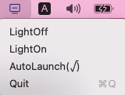

# UnlightInnerScreen

## 简介
这个程序用来把 MacBook 的屏幕的亮度降低. 主要是用来在把 MacBook 连接外置显示器后, 我没找到比较好的办法把 MacBook 本身屏幕关掉(如果有人知道, 请告诉我), 所以我写了一个程序, 把 MacBook 自身屏幕关掉.

这个程序就两个功能:
* MacBook 自带屏幕亮度开关
* 开机自启动.

## Description
This program is used to light off MacBook's inner screen.

Just two functions:
* light off/up MacBook's inner screen
* auto launch when login

